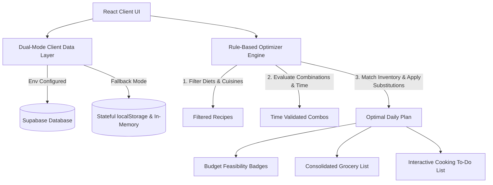
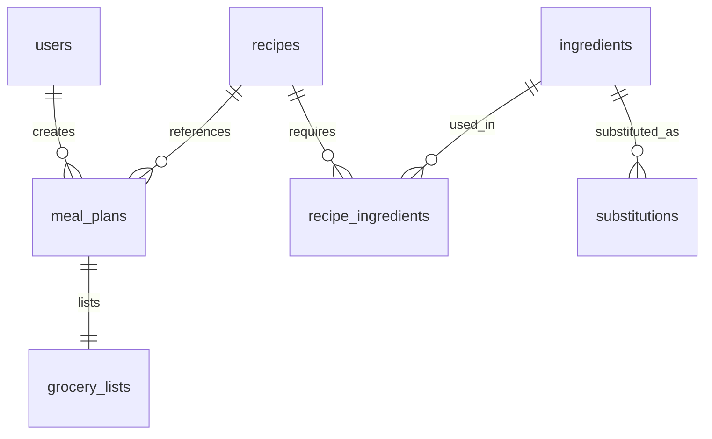

# ChefFlow - Rule-Based Meal Planning Micro-App

ChefFlow is a lightweight, responsive, and deterministic daily meal-planning micro-app that generates personalized cooking to-do lists, grocery lists, and budget feasibility checks.

> [!NOTE]
> **No AI, Machine Learning, or External APIs**: All calculations, ingredient replacements, and meal selections are executed locally using strict, predefined mathematical rules and relational mapping algorithms.

---

## 1. Product Overview
ChefFlow helps individuals optimize their daily cooking cycles. By inputting core criteria (people count, budget, cooking time limits, dietary preferences, cuisine choices, and inventory in their fridge), the system generates:
- An optimized daily breakfast, lunch, and dinner meal schedule.
- An interactive, step-by-step cooking task checklist.
- A consolidated grocery shopping list detailing quantities, units, and itemized costs.
- Predefined ingredient substitutions to minimize immediate grocery costs.
- Budget feasibility metrics.

---

## 2. System Architecture



The stack consists of:
- **Frontend**: React + Vite + Tailwind CSS v4 (using the `@tailwindcss/vite` plugin for build optimizations).
- **Icons**: Lucide React.
- **Database**: Supabase Database REST API client with a stateful `localStorage` mock database fallback.

---

## 3. Database Design

The database stores recipes, ingredients, relations, substitutions, and plan records. It is defined across 7 tables:
1. **`users`**: User registration profiles.
2. **`ingredients`**: Base ingredients index including average unit cost.
3. **`recipes`**: Recipes metadata (times, instructions, dietary/cuisine categorization).
4. **`recipe_ingredients`**: Join table matching ingredients and quantities to recipes.
5. **`substitutions`**: Predefined mappings (e.g. Milk → Oat Milk) with quantity conversion ratios.
6. **`meal_plans`**: Logs of generated meal plan sessions.
7. **`grocery_lists`**: Saved grocery checklists linked to meal plan sessions.

### Relational Schema



---

## 4. Supabase SQL Setup

The SQL script creates tables, RLS security policies, performance indexes, and inserts realistic sample seeds.
- **Schema File**: [supabase_schema.sql](file:///c:/Prompt%20Wars/SC-Prompt-Warrior/supabase_schema.sql)

### Setup Steps
1. Create a free project on [Supabase Console](https://database.new).
2. Go to the **SQL Editor** tab.
3. Paste the contents of [supabase_schema.sql](file:///c:/Prompt%20Wars/SC-Prompt-Warrior/supabase_schema.sql).
4. Click **Run**. All tables, indexes, and seed data will be populated instantly.

---

## 5. API / Data Access Layer

The database connection is managed by [supabaseClient.js](file:///c:/Prompt%20Wars/SC-Prompt-Warrior/src/supabaseClient.js). It dynamically checks for environment variables:
- `VITE_SUPABASE_URL`
- `VITE_SUPABASE_ANON_KEY`

If missing, it falls back to the local database in [mockDatabase.js](file:///c:/Prompt%20Wars/SC-Prompt-Warrior/src/data/mockDatabase.js).

---

## 6. Frontend Components

- **`App.jsx`** ([App.jsx](file:///c:/Prompt%20Wars/SC-Prompt-Warrior/src/App.jsx)): Orchestrates global states, loads database tables, runs the optimization loop, and presents the main page layout.
- **`InputForm.jsx`** ([InputForm.jsx](file:///c:/Prompt%20Wars/SC-Prompt-Warrior/src/components/InputForm.jsx)): Input panel containing parameter sliders, drop-down menus, and search filters.
- **`BudgetCard.jsx`** ([BudgetCard.jsx](file:///c:/Prompt%20Wars/SC-Prompt-Warrior/src/components/BudgetCard.jsx)): Computes meal costs, outputs progress bars, and rates budget status (*Within Budget*, *Slightly Over Budget*, *Over Budget*).
- **`MealCards.jsx`** ([MealCards.jsx](file:///c:/Prompt%20Wars/SC-Prompt-Warrior/src/components/MealCards.jsx)): Visualizes breakfast, lunch, and dinner recipe cards, with applied substitutions.
- **`TaskList.jsx`** ([TaskList.jsx](file:///c:/Prompt%20Wars/SC-Prompt-Warrior/src/components/TaskList.jsx)): Displays step-by-step checklist tasks for preparation and cooking.
- **`GroceryList.jsx`** ([GroceryList.jsx](file:///c:/Prompt%20Wars/SC-Prompt-Warrior/src/components/GroceryList.jsx)): Consolidates required purchases, aggregates duplicate items, subtracts checked off costs, and lists applied substitution mappings.

---

## 7. Folder Structure

```
SC-Prompt-Warrior/
├── index.html                   # HTML Entry point & meta tags
├── package.json                 # Project dependencies & build scripts
├── vite.config.js               # Vite + React + Tailwind v4 configs
├── supabase_schema.sql          # Supabase SQL table schemas & seed values
└── src/
    ├── main.jsx                 # Bootstraps React into the DOM
    ├── App.jsx                  # State coordination & layout coordinator
    ├── index.css                # Global CSS directives & custom range thumbs
    ├── supabaseClient.js         # Unified Supabase DB wrapper with Offline Fallback
    ├── data/
    │   └── mockDatabase.js      # Seed variables & local persistent storage methods
    ├── utils/
    │   └── planner.js           # Predefined rule-based solver matching engine
    └── components/
        ├── InputForm.jsx        # Controls panel & autocomplete tags search
        ├── BudgetCard.jsx       # Costs details & progress feasibility bar
        ├── MealCards.jsx        # Selected recipe display layouts & swap details
        ├── TaskList.jsx         # Consolidated interactive cooking checklists
        └── GroceryList.jsx      # Purchases checklists & conversion references
```

---

## 8. Source Code Reference

You can access the individual implementation source codes here:
- App Container: [App.jsx](file:///c:/Prompt%20Wars/SC-Prompt-Warrior/src/App.jsx)
- Rule Solver Engine: [planner.js](file:///c:/Prompt%20Wars/SC-Prompt-Warrior/src/utils/planner.js)
- Supabase Client Layer: [supabaseClient.js](file:///c:/Prompt%20Wars/SC-Prompt-Warrior/src/supabaseClient.js)
- Mock Seed File: [mockDatabase.js](file:///c:/Prompt%20Wars/SC-Prompt-Warrior/src/data/mockDatabase.js)
- CSS styles: [index.css](file:///c:/Prompt%20Wars/SC-Prompt-Warrior/src/index.css)

---

## 9. Deployment Guide

### Local Development
1. Clone the repository and open a terminal in the folder.
2. Install dependencies:
   ```bash
   npm install
   ```
3. Run the development server:
   ```bash
   npm run dev
   ```
4. Access the app in your browser at `http://localhost:5173`.

### Connecting to Live Supabase
1. Create a file named `.env` in the root folder.
2. Add your credentials:
   ```env
   VITE_SUPABASE_URL=https://your-project-id.supabase.co
   VITE_SUPABASE_ANON_KEY=your-anon-public-key
   ```
3. Restart your development server. The connection badge in the top right header will change to: `🟢 Supabase Database`.

### Web Hosting (Vercel / Netlify)
1. Push your code to a GitHub repository.
2. Connect your repository to Vercel or Netlify.
3. Configure the Environment Variables inside the Hosting Provider's settings:
   - Key: `VITE_SUPABASE_URL` | Value: Your Supabase URL
   - Key: `VITE_SUPABASE_ANON_KEY` | Value: Your Anon Key
4. Deploy the build output. The framework compiles the optimized JS/CSS bundle immediately.

---

## 10. Example End-to-End User Flow

1. **Configuration**: A user wants to feed **2 people** on a budget of **$30.00** for the day. They have **20 minutes** max cooking time limit, are looking for **Keto** meals, and already have **Avocado** in their pantry.
2. **Pantry Selection**: The user enters "Avocado" in the pantry search input, select it, and it appears as a tag. They check "Breakfast", "Lunch", and "Dinner" as required.
3. **Engine Search**: They click "Generate Meal Plan". The local `planner.js` solver instantly executes:
   - Filters recipes matching **Keto** (e.g. Scrambled Eggs with Spinach/Bacon, Chicken Avocado Salad, Garlic Butter Salmon).
   - Simulates permutations. Since the Salmon Dinner + Avocado Salad lunch exceeds 20 minutes cook time, the engine checks combinations, detects that no combination fits the 20-minute limit, gracefully relaxes the time constraint, selects the fastest Keto option, and flags a warning.
   - Calculates recipe costs scaled for 2 people.
   - Re-evaluates ingredients. For "Chicken Avocado Salad" lunch, the recipe needs Avocados. Since "Avocado" is in the user's available list, the system sets the Avocado purchase quantity to $0$ and removes it from the grocery checklist.
   - For "Scrambled Eggs" breakfast, the recipe requires butter. The user doesn't have butter, but has olive oil. The system detects a predefined mapping (Butter → Olive Oil), applies it, updates the recipe badge, and keeps the grocery list clean.
4. **Dashboard Outputs**:
   - **Feasibility Card**: Shows cost vs budget (e.g., Total cost is $22.00, budget is $30.00: Status: **Within Budget**).
   - **Meal Cards**: Displays beautiful Keto cards.
   - **To-Do Steps**: Outputs ordered tasks (e.g., Step 1: Cook bacon, Step 2: Scramble eggs, etc.).
   - **Grocery Bill Checklist**: Outputs remaining items (Eggs, Bacon, Chicken, Spinach) with aggregated quantities, costs, and checkbox toggles.
5. **Persistence**: The user clicks "Save Daily Plan". The client posts records to Supabase tables (or saves locally in localStorage). The plan now appears under the user's **History** list, allowing instant reload at any time!
